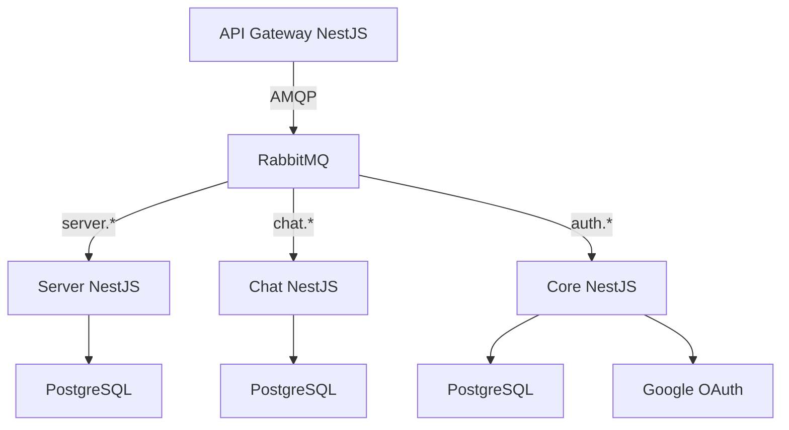

# Kairos

<p align="center">
  <a href="https://skillicons.dev">
    
  </a>
</p>

---

## Содержание

1. [Архитектура](#архитектура)
2. [Конфигурация](#конфигурация)
3. [Установка и запуск](#установка-и-запуск)
4. [Библиотеки](#библиотеки)
5. [Prisma схемы](#prisma-схемы)
6. [Мониторинг](#мониторинг)
7. [Тестирование](#тестирование)

## Архитектура

- **Gateway**: маршрутизация запросов к микросервисам.
- **Core**: аутентификация `JWT`.
- **Chat**: текстовые, голосовые и видеоканалы `mediasoup` `SocketIO`.
- **Server**: создание и управление серверами и каналами.



## Конфигурация

В `.env` требуется указать переменные как в `.env.example` для запуска `docker-контейнеров`

В `.env.development` требуется указать переменные как в `.env.example` для локального запуска

| Переменная                | Описание                                          | Значение по умолчанию                                                          |
| ------------------------- | ------------------------------------------------- | ------------------------------------------------------------------------------ |
| **Общие настройки**       |                                                   |                                                                                |
| `NEST_DEBUG`              | Режим отладки NestJS (вывод подробных логов)      | `true`                                                                         |
| **MediaSoup (WebRTC)**    |                                                   |                                                                                |
| `WEBRTC_LISTEN_IP`        | Локальный IP для приёма медиа-трафика             | `127.0.0.1`                                                                    |
| `WEBRTC_ANNOUNCED_IP`     | Публичный IP, передаваемый клиентам               | `127.0.0.1`                                                                    |
| `MEDIASOUP_NUM_WORKERS`   | Количество worker-процессов для обработки медиа   | `2`                                                                            |
| **Gateway**               |                                                   |                                                                                |
| `PORT`                    | Порт для основного шлюза                          | `3000`                                                                         |
| **Chat Service**          |                                                   |                                                                                |
| `CHAT_PORT`               | Порт сервиса чата                                 | `3001`                                                                         |
| `RABBIT_MQ_CHAT_CLIENT`   | Идентификатор клиента RabbitMQ для чат-сервиса    | `chat_client`                                                                  |
| `RABBIT_MQ_CHAT_QUEUE`    | Название очереди RabbitMQ для чат-сервиса         | `chat`                                                                         |
| `CHAT_DATABASE_URL`       | Строка подключения к БД чатов                     | `postgresql://<USER>:<PASSWORD>@<HOST>:<PORT>/<DATABASE>?schema=<SCHEMA_NAME>` |
| `CLIENT_URL`              | URL клиентского приложения для CORS               | `http://localhost:1420`                                                        |
| **Core Service**          |                                                   |                                                                                |
| `CORE_PORT`               | Порт сервиса аутентификации                       | `3002`                                                                         |
| `RABBIT_MQ_CORE_CLIENT`   | Идентификатор клиента RabbitMQ для core-сервиса   | `core_client`                                                                  |
| `RABBIT_MQ_CORE_QUEUE`    | Название очереди RabbitMQ для core-сервиса        | `core`                                                                         |
| `USER_DATABASE_URL`       | Строка подключения к БД пользователей             | `postgresql://<USER>:<PASSWORD>@<HOST>:<PORT>/<DATABASE>?schema=<SCHEMA_NAME>` |
| **Server Service**        |                                                   |                                                                                |
| `SERVER_PORT`             | Порт сервиса управления серверами                 | `3003`                                                                         |
| `RABBIT_MQ_SERVER_CLIENT` | Идентификатор клиента RabbitMQ для server-сервиса | `server_client`                                                                |
| `RABBIT_MQ_SERVER_QUEUE`  | Название очереди RabbitMQ для server-сервиса      | `server`                                                                       |
| `SERVER_DATABASE_URL`     | Строка подключения к БД серверов                  | `postgresql://<USER>:<PASSWORD>@<HOST>:<PORT>/<DATABASE>?schema=<SCHEMA_NAME>` |
| **RabbitMQ**              |                                                   |                                                                                |
| `RABBIT_MQ_URI`           | Полный URI для подключения к RabbitMQ             | `amqp://<USER>:<PASSWORD>@<HOST>:<PORT>`                                       |
| **JWT Authentication**    |                                                   |                                                                                |
| `JWT_ACCESS_SECRET`       | Секрет для подписи access-токенов                 | `'secret'`                                                                     |
| `JWT_ACCESS_EXPIRES`      | Время жизни access-токена                         | `'15min'`                                                                      |
| `JWT_REFRESH_SECRET`      | Секрет для подписи refresh-токенов                | `'secret'`                                                                     |
| `JWT_REFRESH_EXPIRES`     | Время жизни refresh-токена                        | `'7d'`                                                                         |
| **Minio (File Storage)**  |                                                   |                                                                                |
| `MINIO_ENDPOINT`          | Адрес Minio сервера                               | `minio`                                                                        |
| `MINIO_PORT`              | Порт Minio сервера                                | `9000`                                                                         |
| `MINIO_ACCESS_KEY`        | Ключ доступа к Minio                              | `admin`                                                                        |
| `MINIO_SECRET_KEY`        | Секретный ключ для Minio                          | `adminadmin`                                                                   |
| `MINIO_USE_SSL`           | Использовать SSL для подключения к Minio          | `false`                                                                        |
| `MINIO_BUCKET_NAME`       | Название бакета для хранения файлов               | `discord-files`                                                                |
| **OAuth Providers**       |                                                   |                                                                                |
| `CLIENT_ID`               | ID приложения для OAuth-провайдера                | `'id'`                                                                         |
| `CLIENT_SECRET`           | Секрет для OAuth-провайдера                       | `'secret'`                                                                     |
| `CALLBACK_URL`            | URL для callback после аутентификации             | `'callback'`                                                                   |

## Установка и запуск

Установить зависимости:

```
npm install
```

Собрать и запустить контейнеры:

```
docker-compose up -d
```

Выполнить миграции:

```
docker-compose -f docker-compose.migrate.yaml up -d
```

Запустить локально:

```
npm run start:all
```

## Библиотеки

| Библиотека | Функционал                           |
| ---------- | ------------------------------------ |
| `core-lib` | JWT-аутентификация и guards для Nest |
| `database` | Общие Dto                            |
| `files`    | Загрузка и хранение файлов S3        |


## Prisma схемы

Расположены:

```
prisma/
├── chat/    # Схема для чат-сервиса
├── server/  # Схема для управления серверами
└── user/    # Схема пользователей (core)
```


Генерация клиента и миграции:

```
# Для генерации Prisma-клиента
npm run prisma:gen

# Для создания и применения миграций
npm run prisma:migrate
```

## Мониторинг

Для просмотра метрик используются следующие дашборды:

- **Node Exporter**  
  ID дашборда: `11159`  
  Шаблон: Node Exporter Full

- **RabbitMQ**  
  ID дашборда: `10991`  
  Шаблон: RabbitMQ Monitoring

- **PostgreSQL**  
  ID дашборда: `9628`  
  Шаблон: PostgreSQL Database

- **Redis**  
  ID дашборда: `11835`  
  Шаблон: Redis Dashboard

- **MinIO**  
  Конфигурация дашборда находится в файле: `grafana/dashboards/minio-dashboard.json`

Для импорта:

1. Перейдите в Grafana → Create → Import
2. Введите ID дашборда или загрузите JSON-файл для MinIO
3. Выберите соответствующий источник данных

Требуемые данные источников должны быть предварительно настроены в Grafana.


## Тестирование

Запуск тестов:

```
npm run test
```

[Swagger](http://localhost:3000/api)
